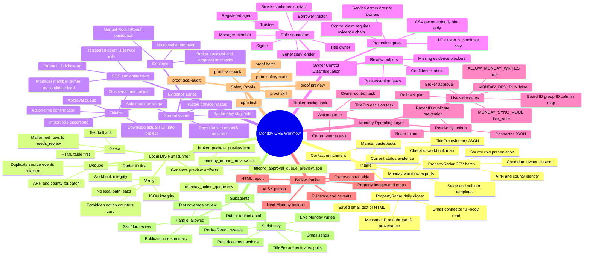
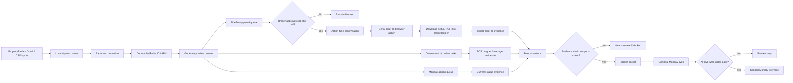

# Monday CRE Workflow Mind Map

This is the high-level operating model for the Monday-first distressed CRE workflow. It is intentionally specific to the current workflow: PropertyRadar/Gmail intake, Monday action queues, TitlePro evidence, owner/control disambiguation, and broker packet output.

## Mind Map

## Process Flow

## Artifact Map

| Lane | Primary Files |
| --- | --- |
| Digest preview | `outputs/monday_digest_runs/gmail-preview/` |
| Batch owner clusters | `outputs/monday_digest_runs/batch-owner-clusters/` |
| TitlePro approval | `titlepro_approval_queue_preview.json`, `titlepro_pull_requests_approved.json` |
| TitlePro PDF evidence | `outputs/distressed_cre_research/<run>/documents/<property-slug>/` or `outputs/titlepro_evidence/<YYYY-MM-DD>/<property-slug>/` |
| Monday actions | `monday_action_queue.csv` |
| Broker packet | `broker_owner_control_report.html`, `owner_disambiguation_packet.xlsx` |
| Skill docs | `codex_skills/monday-cre-workflow/skills/` |

## Core Rule

The system can move fast, but only locally until the exact external action is approved. CSV owner strings, LLC clusters, contacts, and service actors are leads for research, not ownership/control conclusions.
